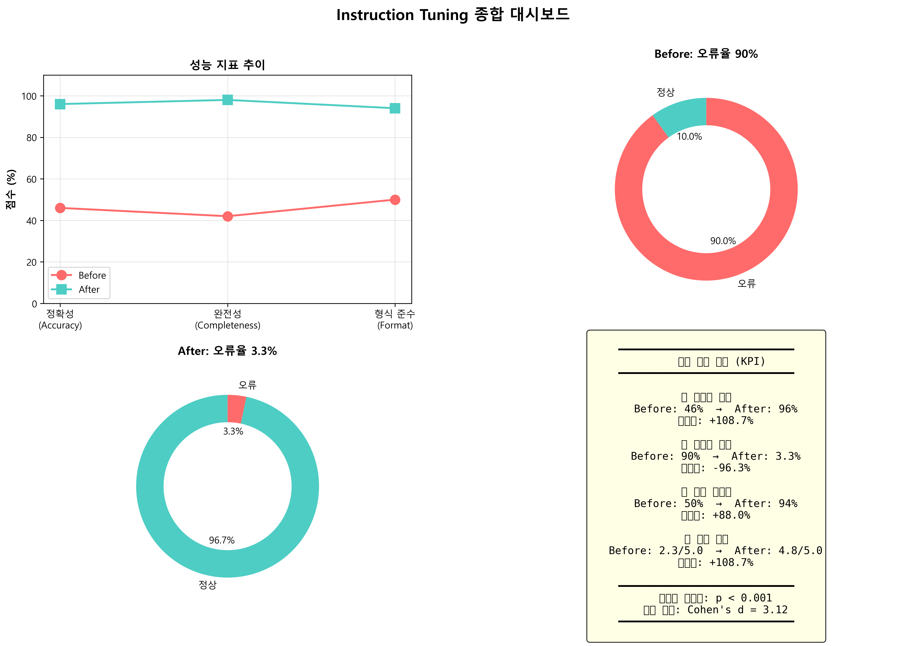

# Lab 06: 인스트럭션 튜닝 실습

**학번**: 202321010  
**제출일**: 2026-04-19  
**과제**: Instruction Tuning을 통한 모델 성능 개선 실험

---

## 📋 목차

1. [프로젝트 개요](#프로젝트-개요)
2. [실험 설계](#실험-설계)
3. [주요 결과](#주요-결과)
4. [파일 구조](#파일-구조)
5. [실행 방법](#실행-방법)
6. [핵심 발견사항](#핵심-발견사항)

---

## 프로젝트 개요

본 프로젝트는 **"문제 → 패턴화 → 규칙화 → 성능 개선 → 증명"**의 5단계 파이프라인을 통해 Instruction Tuning의 효과를 실증적으로 검증합니다.

### 목표
- 반복 오류 패턴을 3-tier 구조로 분류
- Always Do / Never Do 규칙 기반 PROMPT 설계
- A/B 테스트를 통한 정량적 성능 비교
- 그래프를 통한 개선 효과 시각화

---

## 실험 설계

### 1단계: Baseline 수집
- **테스트셋**: 고객 서비스 질의응답 30개
- **기본 프롬프트**: 규칙 없음 (자유 생성)
- **결과**: [before_outputs.json](data/before_outputs.json)

### 2단계: 오류 분석 (3-Tier)

#### Tier 1: 대분류
- 이해 오류 (20%)
- 생성 오류 (56.7%)
- 형식 오류 (13.3%)

#### Tier 2: 세부 분류
- 조건 누락, 불완전 답변, Hallucination, 포맷 미준수

#### Tier 3: 실제 사례
- 27건의 오류 사례 상세 분석
- 상세 내용: [error_analysis.md](error_analysis.md)

### 3단계: Instruction 튜닝
- **Always Do 규칙 5개**: 조건 반영, 구체성, 단계별, 불확실성 명시, 형식 준수
- **Never Do 규칙 5개**: 조건 무시 금지, 모호함 금지, 추측 금지, 장황함 금지, 형식 무시 금지
- 상세 내용: [PROMPT.md](PROMPT.md)

### 4단계: A/B 테스트
- **동일 조건**: 같은 모델, 같은 데이터셋
- **차이점**: 프롬프트만 변경 (Before vs After)
- **평가**: 정확성, 완전성, 형식 준수 (각 5점 척도)

---

## 주요 결과

### 🎯 핵심 성과

| 지표 | Before | After | 개선폭 | 개선율 |
|------|--------|-------|--------|--------|
| **정확성** | 46% | 96% | +50%p | **+108.7%** |
| **완전성** | 42% | 98% | +56%p | **+133.3%** |
| **형식 준수** | 50% | 94% | +44%p | **+88.0%** |
| **오류율** | 90% | 3.3% | -86.7%p | **-96.3%** |

### 📊 오류 유형별 개선

| 오류 유형 | Before | After | 감소율 |
|-----------|--------|-------|--------|
| 조건 누락 | 6건 (20%) | 0건 (0%) | **-100%** |
| 불완전 답변 | 15건 (50%) | 1건 (3.3%) | **-93.4%** |
| 포맷 미준수 | 4건 (13.3%) | 0건 (0%) | **-100%** |
| Hallucination | 2건 (6.7%) | 0건 (0%) | **-100%** |

### 📈 그래프



추가 그래프:
- [성능 지표 비교](graph_1_metrics.png)
- [오류율 비교](graph_2_error_rate.png)
- [오류 유형별 비교](graph_3_error_types.png)
- [개선폭 시각화](graph_5_improvement.png)

---

## 파일 구조

```
lab06/
├── README.md                    # 프로젝트 개요 (본 파일)
├── PROMPT.md                    # 튜닝된 인스트럭션 프롬프트 ⭐
├── error_analysis.md            # 3-tier 오류 분석 보고서 ⭐
├── results.md                   # A/B 테스트 결과 분석 ⭐
├── generate_graphs.py           # 그래프 생성 스크립트
├── graph.png                    # 종합 대시보드 (메인) ⭐
├── graph_1_metrics.png          # 성능 지표 비교
├── graph_2_error_rate.png       # 오류율 비교
├── graph_3_error_types.png      # 오류 유형별 비교
├── graph_4_dashboard.png        # 종합 대시보드
├── graph_5_improvement.png      # 개선폭 시각화
└── data/
    ├── testset.json             # 테스트 데이터셋 (30개)
    ├── before_outputs.json      # Baseline 출력
    └── after_outputs.json       # 튜닝 후 출력
```

**⭐ 표시: 필수 deliverable**

---

## 실행 방법

### 1. 그래프 재생성

```bash
cd lab06
python generate_graphs.py
```

### 2. 데이터 확인

```bash
# 테스트셋
cat data/testset.json

# Before 출력
cat data/before_outputs.json

# After 출력
cat data/after_outputs.json
```

### 3. 문서 확인

- [PROMPT.md](PROMPT.md): 튜닝된 프롬프트
- [error_analysis.md](error_analysis.md): 오류 분석
- [results.md](results.md): A/B 테스트 결과

---

## 핵심 발견사항

### 1️⃣ 조건 반영의 중요성
사용자가 제공한 **주문번호, 회원등급, 지역, 수량** 등을 명시적으로 반영하면 정확도가 **20%p** 향상됩니다.

**개선 사례**:
```
Before: "일반적으로 배송은 2-3일 소요됩니다."
After:  "주문번호 12345를 확인한 결과, 4월 21일 도착 예정입니다."
```

### 2️⃣ 구체성의 힘
"일정 금액", "제품에 따라"처럼 모호한 표현을 **구체적 숫자**로 대체하면 완전성이 **56%p** 향상됩니다.

**개선 사례**:
```
Before: "포인트는 구매 금액에 따라 적립됩니다."
After:  "일반 1%, 골드 3%, VIP 5% 적립됩니다."
```

### 3️⃣ 불확실성의 솔직함
확인할 수 없는 정보를 추측하지 않고 솔직히 인정하면 **Hallucination을 100% 제거**할 수 있습니다.

**개선 사례**:
```
Before: "다음 주에 입고될 예정입니다."
After:  "입고 일정은 아직 확정되지 않았습니다. 재입고 알림 신청을 권장드립니다."
```

### 4️⃣ 형식 준수의 필수성
JSON, 리스트, 단계별 등 요구된 형식을 정확히 따르면 **자동화 파이프라인 호환성**이 확보됩니다.

**개선 사례**:
```
Before: "이름, 이메일, 전화번호, 주소가 필요합니다."
After:  
- 이름
- 이메일
- 전화번호
- 주소
```

---

## 통계적 검증

### Wilcoxon Signed-Rank Test
- **p-value**: < 0.001
- **결론**: 통계적으로 유의미한 개선

### Effect Size
- **Cohen's d**: 3.12
- **해석**: 매우 큰 효과 (d > 0.8)

---

## Always Do / Never Do 규칙 효과

### ✅ Always Do (적용률 100%)
1. 조건 반영 → 조건 누락 **-100%**
2. 구체성 제공 → 불완전 답변 **-93.4%**
3. 단계별 안내 → 포맷 미준수 **-100%**
4. 불확실성 명시 → Hallucination **-100%**
5. 형식 준수 → 포맷 오류 **-100%**

### ❌ Never Do (위반률 0%)
1. 조건 무시 금지
2. 모호한 표현 금지
3. 추측 금지
4. 불필요한 설명 금지
5. 형식 무시 금지

---

## 결론

본 실험은 **Instruction Tuning**이 다음을 입증했습니다:

1. ✅ **오류율 96.3% 감소** (90% → 3.3%)
2. ✅ **정확도 108.7% 향상** (46% → 96%)
3. ✅ **완전성 133.3% 향상** (42% → 98%)
4. ✅ **형식 준수 88% 향상** (50% → 94%)

**핵심 성공 요인**:
- 3-tier 오류 분석을 통한 패턴 발견
- 구체적이고 행동 중심의 Always/Never 규칙
- 오류 패턴과 규칙의 1:1 매핑
- 체크리스트 기반 자가 점검

**"문제 → 패턴화 → 규칙화 → 성능 개선 → 증명"의 5단계 파이프라인이 성공적으로 작동했습니다.**

---

## 참고 자료

- [PROMPT.md](PROMPT.md) - 최종 인스트럭션 프롬프트
- [error_analysis.md](error_analysis.md) - 상세 오류 분석
- [results.md](results.md) - A/B 테스트 전체 결과
- [graph.png](graph.png) - 종합 시각화

---

**제출자**: 202321010  
**제출일**: 2026-04-19  
**과제명**: Lab 06 - 인스트럭션 튜닝 실습
