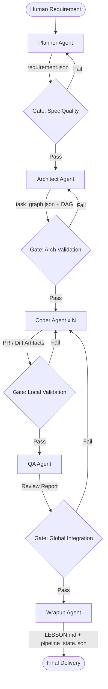

# Multi-Agent SDLC Architecture Diagram
Student ID: 202321006

## 5-Phase Gated Pipeline

## Agent Roles and Responsibilities
| Agent | Role | Artifacts | Responsibility |
|-------|------|-----------|----------------|
| **Planner** | Product Manager | `requirement.json` | Requirement parsing, AC definition |
| **Architect** | Software Architect | `task.json`, DAG | Dependency analysis, task decomposition |
| **Coder** | Developer | Pull Request, Diffs | Implementation in Ralph Loop |
| **QA** | Quality Assurance | Review Report | Integration testing, security review |
| **Wrapup** | Knowledge Manager | `LESSON.md`, State Update | Knowledge capture, final merging |
